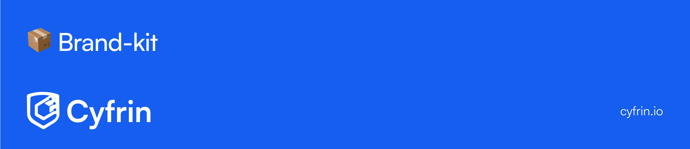

<h1 align="center">
     
    📦 Cyfrin Brand Kit
     
</h1>

<strong>
Welcome to the Cyfrin Brand Kit! Here you will find the logos, colours and brand guidelines used at Cyfrin and in our ecosystem.
</strong>

     
    
     

# 🎨 Colors

Cyfrin uses a universal colour palette for error, success, warning, and information messages, as well as text colours. The colours are used to provide a consistent user experience across all our products and services. These colours are used universally between dark and light themes.

The only exception to this is the brand colours, which are unique to each product and service. The brand colours are used to differentiate between our offerings and are used in the logos of its respective products and services.

## Brand Colours

A detailed colour palette of the brand colours used at Cyfrin is available [here](media/colors/README.md).

## Getting Started

Tailwind variables for the Cyfrin brand colours are available in the [here](media/colors/tailwind.config.js), the css variables are available [here](media/colors/styles.css).

# 🖼️ Logos

Logos for the Cyfrin brand ecosystem available, including: Cyfrin, CodeHawks, Updraft, and Solodit. The logos are available in dark, light, and colour versions. These can be found in the respective directories as well as in a [table](media/logos/README.md).

<a href="https://docs.cyfrin.io">Docs</a>
<a href="https://discord.gg/cyfrin">Get support</a>
<a href="https://cyfrin.io">Website</a>
<a href="https://twitter.com/cyfrinaudits">Twitter</a>

---
